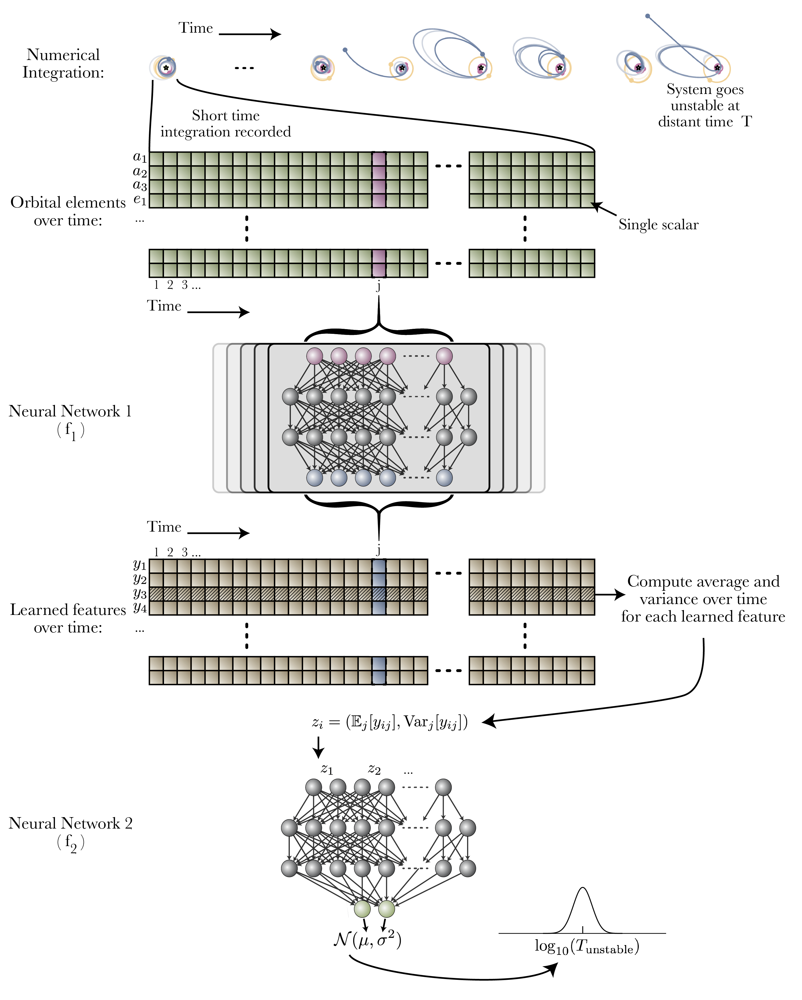

# [A Bayesian neural network predicts the dissolution of compact planetary systems](https://arxiv.org/abs/2101.04117)

This repository is the official implementation of the paper https://arxiv.org/abs/2101.04117,
containing training code, evaluation scripts, and figure generation.

For an easy-to-use API implementing
a trained version of this model, check out [spock](https://github.com/dtamayo/spock)!

# Running

To train the model, download the data into the `/data` folder
from this [Globus link](https://app.globus.org/file-manager?origin_id=ae09b8a8-5040-11eb-a4d1-0a53a3613b81&origin_path=%2F).

Run the script `train.sh`, which will train
the model 30 times from different seeds.

To generate the figures, edit the `figures/generate.sh` script
to have `true` instead of `false` for any figure you'd like to generate.
Then, execute that script in the folder.

# Requirements

One can install a working conda environment using `create_env.sh`.

This file also contains a list of packages required by this model.
